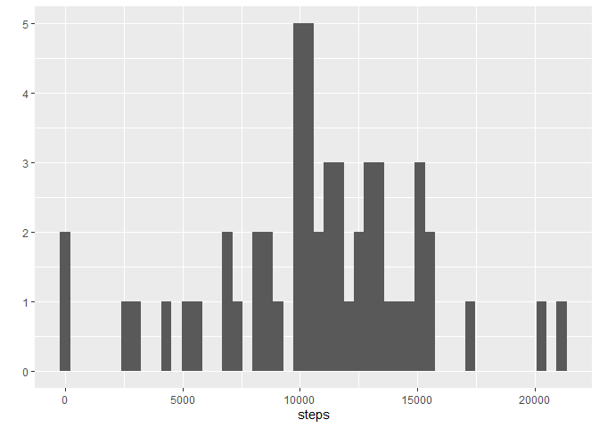
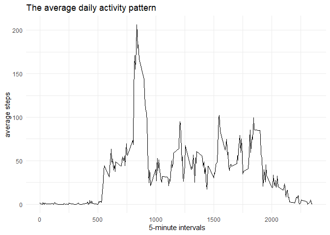
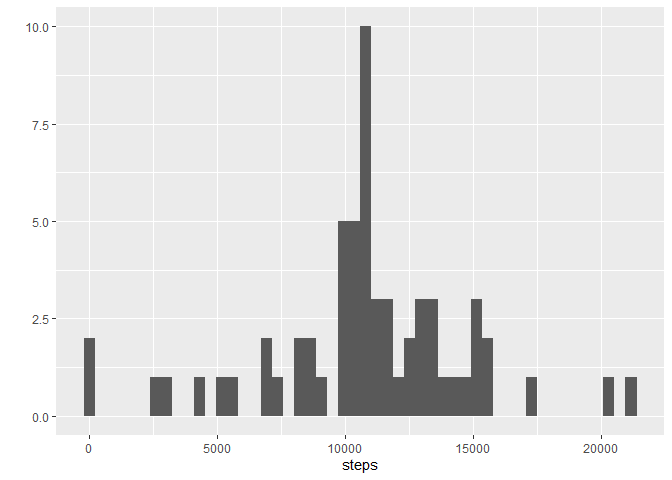
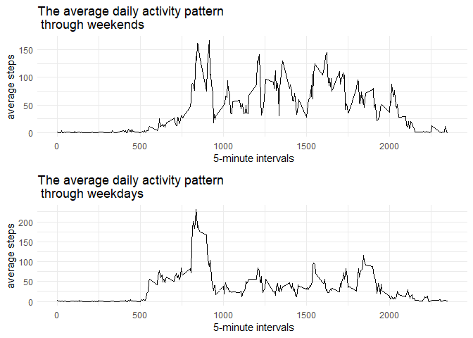

## Loading and preprocessing the data

First, loading the zip file and unziping it, then reading the csv data file: 


```r
if (!file.exists("raw_data.zip")){
  print("loading the zip file............... ")
  fileURL <- "https://d396qusza40orc.cloudfront.net/repdata%2Fdata%2Factivity.zip"
  download.file(fileURL, "raw_data.zip", method="curl")
}  
if (!file.exists("activity.csv")) { 
  print("unziping the data...................")
  unzip("raw_data.zip") 
}

library(readr)
activity_full <- read_csv("activity.csv")
library(knitr)
kable(head(activity_full), align='c')
```


 steps       date       interval 
-------  ------------  ----------
  NA      2012-10-01       0     
  NA      2012-10-01       5     
  NA      2012-10-01       10    
  NA      2012-10-01       15    
  NA      2012-10-01       20    
  NA      2012-10-01       25    

Second, processing the data; I delete the lines with NA values:


```r
activity <- activity_full[ !is.na(activity_full$steps),]
kable( head(activity), align='c' )
```


 steps       date       interval 
-------  ------------  ----------
   0      2012-10-02       0     
   0      2012-10-02       5     
   0      2012-10-02       10    
   0      2012-10-02       15    
   0      2012-10-02       20    
   0      2012-10-02       25    


## What is mean total number of steps taken per day?

I calcute down below the total number of steps taken per day:


```r
activity_sum <- aggregate(steps~date, data=activity, sum)
head(activity_sum)
```

```
##         date steps
## 1 2012-10-02   126
## 2 2012-10-03 11352
## 3 2012-10-04 12116
## 4 2012-10-05 13294
## 5 2012-10-06 15420
## 6 2012-10-07 11015
```

Then I plot the histogram of the total number of steps taken each day


```r
library(ggplot2)
qplot(steps, data = activity_sum, bins=50)
```

<!-- -->


The next step is to calculate the mean and median of the total number of steps taken per day


```r
mean_steps <- mean(activity_sum$steps)
median_steps <- round(median(activity_sum$steps),2)
```
The mean of total steps is 1.0766189\times 10^{4}, and their median is 1.0765\times 10^{4}.


```r
averages1 <- c( round( mean(activity_sum$steps), 2), round( median(activity_sum$steps), 2))
averages1
```

```
## [1] 10766.19 10765.00
```
The mean of total steps is **10766.19** and their median is **10765**.


  
    
      
       


## What is the average daily activity pattern?

We need to plot the average daily activity pattern corresponding to each 5-minute interval: (the average calculated using the mean function)


```r
interval_avrg <- aggregate(steps~interval, data=activity, mean)
p1 <- ggplot(data=interval_avrg, aes(x=interval, y=steps)) +
      geom_line()+
      ggtitle("The average daily activity pattern") +
      xlab(" 5-minute intervals") + ylab("average steps")+
      theme_minimal()
p1
```

<!-- -->

Let's get the 5-minute interval which, on average across all the days in the dataset, contains the maximum number of steps:


```r
int_max <- interval_avrg[which.max(interval_avrg$steps),]
kable(int_max, digits=2, align='c')
```

       interval    steps  
----  ----------  --------
104      835       206.17 
  
It's the 835 5-minute interval!


## Imputing missing values

We'll calculate the number of rows that contains NA's values. To do so, we can use the summary function:


```r
kable(summary(activity_full), align='c')
```

            steps                date             interval   
---  ----------------  --------------------  ----------------
      Min.   :  0.00    Min.   :2012-10-01    Min.   :   0.0 
      1st Qu.:  0.00    1st Qu.:2012-10-16    1st Qu.: 588.8 
      Median :  0.00    Median :2012-10-31    Median :1177.5 
      Mean   : 37.38    Mean   :2012-10-31    Mean   :1177.5 
      3rd Qu.: 12.00    3rd Qu.:2012-11-15    3rd Qu.:1766.2 
      Max.   :806.00    Max.   :2012-11-30    Max.   :2355.0 
       NA's   :2304             NA                  NA       

It's only the `steps` column that has missing value and it has **2304** missing rows.   
  
  
  Since many rows from the first day are missing, my strategy to replace the NAs will be to use the mean of the corresponding 5-minutes-interval across all the days.
  The dataframe `activity_fill_na` is a copy of the original full raw data, but is going to be modified in order to replace the NA values from the `steps` column:


```r
nrows <- dim(activity_full)[1]
activity_fill_na <- data.frame(activity_full)
for( i in 1:nrows){
  if ( is.na(activity_fill_na$steps[i])){
    index_mean_intrvl <- which(interval_avrg$interval==activity_fill_na$interval[i])
    activity_fill_na$steps[i] <- interval_avrg$steps[index_mean_intrvl]
  }
}
kable( head(activity_fill_na, 10), align='c')
```


   steps         date       interval 
-----------  ------------  ----------
 1.7169811    2012-10-01       0     
 0.3396226    2012-10-01       5     
 0.1320755    2012-10-01       10    
 0.1509434    2012-10-01       15    
 0.0754717    2012-10-01       20    
 2.0943396    2012-10-01       25    
 0.5283019    2012-10-01       30    
 0.8679245    2012-10-01       35    
 0.0000000    2012-10-01       40    
 1.4716981    2012-10-01       45    

Now let's plot a histogram of the total number of steps taken each day:


```r
activity_sum2 <- aggregate(steps~date, data=activity_fill_na, sum)
qplot(steps, data = activity_sum2, bins=50)
```

<!-- -->


```r
averages2 <- c( round( mean(activity_sum2$steps), 2), round( median(activity_sum2$steps), 2))
averages2
```

```
## [1] 10766.19 10766.19
```
The mean of total steps is **10766.19** and their median is **10766.19**.  

**Comparison:** The value of the mean is the same before and after imputing missing values, while the median changed and became equal to the mean. 


## Are there differences in activity patterns between weekdays and weekends?  
For this part I use the dataset with the filled-in missing values and create a new factor variable `days` in the dataset with two levels – “weekday” and “weekend” indicating whether a given date is a weekday or weekend day.  
Note that in my r version, the language is french, and so I had to use the french translation for the weekdays.


```r
weekdays_FR <- c("lundi", "mardi", "mercredi", "jeudi", "vendredi")
activity_fill_na$days <- factor(ifelse(weekdays(activity_fill_na$date) %in% weekdays_FR, "weekday", "weekend")) 
```


Now I create two ggplots each one corresponding to weekdays or weekends, and then plotting them together using the `ggarrange` function from the `ggpubr` package:


```r
activity_wkdays <- subset(activity_fill_na, days=='weekday')
interval_avrg_wkdays <- aggregate(steps~interval, data=activity_wkdays, mean)
pwd <- ggplot(data=interval_avrg_wkdays, aes(x=interval, y=steps)) +
      geom_line()+
      ggtitle("The average daily activity pattern\n through weekdays") +
      xlab(" 5-minute intervals") + ylab("average steps")+
      theme_minimal()

activity_wkends <- subset(activity_fill_na, days=='weekend')
interval_avrg_wkends <- aggregate(steps~interval, data=activity_wkends, mean)
pwe <- ggplot(data=interval_avrg_wkends, aes(x=interval, y=steps)) +
      geom_line()+
      ggtitle("The average daily activity pattern\n through weekends") +
      xlab(" 5-minute intervals") + ylab("average steps")+
      theme_minimal()

library(ggpubr)
ggarrange(pwe, pwd,nrow = 2, ncol = 1)
```

<!-- -->

